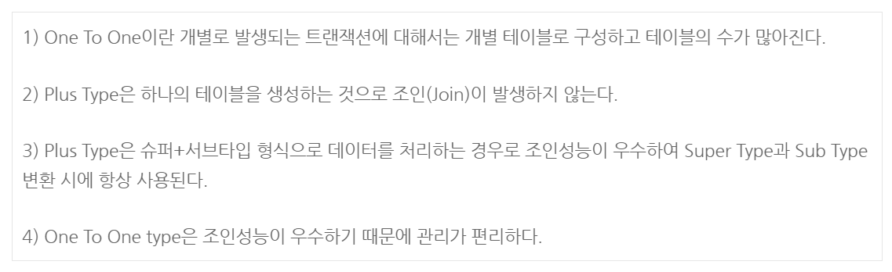
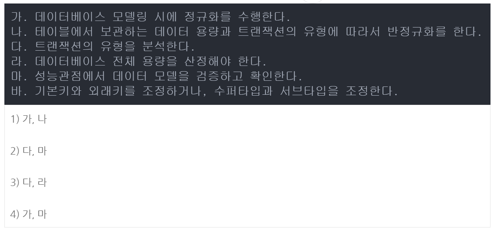
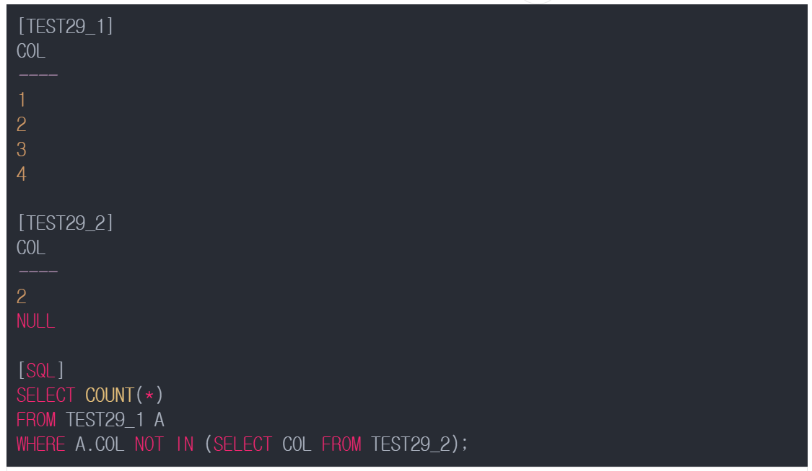

## 기출문제 37회

#### 3. 다음 보기 중 슈퍼/서브타입 데이터 모델의 변환타입에 대한 설명으로 옳은 것은?



> - One To One Type : 슈퍼타입과 서브타입을 개별 테이블로 도출한다. , 테이블의 수가 많아서 조인이 많이 발생하고 관리가 어렵다.
> - Plus Type : 슈퍼타입과 서브타입 테이블로 도출한다. , 조인이 발생하고 관리가 어렵다.
> - Single Type : 슈퍼타입과 서브타입을 하나의 테이블로 도출하는 것이다. , 조인성능이 좋고 관리가 편리하지만, I/O 성능이 좋지 않다.

#### 9. 다음은 데이터베이스 모델링 시에 성능을 고려한 모델링 활동이다. 성능을 고려한 데이터베이스 모델링 단계에서 가장 처음으로 수행해야 할 것과 가장 마지막으로 수행해야 할 것은?



> 성능을 고려한 데이터모델링 순서
>
> - 데이터 모델링을 할 때 정규화를 정확하게 수행
> - 데이터베이스 용량산정 수행
> - 데이터베이스에 발생되는 트랜잭션 유형 파악
> - 용량과 트랜잭션의 유형에 따라 반정규화 수행
> - 이력모델의 조정, PK/FK 조정, 슈퍼타입/서브타입 조정 수행
> - 성능관점에서 데이터 모델 검증

#### 22. 다음 파티션에 대한 설명으로 틀린 것을 고르시오.

```markdown
1) RANK() OVER (PARTITION BY JOB ORDER BY 급여 DESC) JOB_RANK
   #직업별 급여가 높은 순서대로 부여되고 동일한 순위는 동일한 값이 부여 된다.

2) SUM(급여) OVER (PARTITION BY MGR ORDER BY 급여 RANGE UNBOUNDED PRECEDING)
   #RANGE는 논리적 주소에 의한 행 집합을 의미하고 MGR별 현재 행부터 파티션내 첫번째 행까지 급여의 합계를 계산한다.

3) AVG(급여) OVER (PARTITION BY MGR ORDER BY 날짜 ROWS BETWEEN 1 PRECEDING AND 1 FOLLOWING))
   #각 MGR 별로 앞의 한건, 현재 행, 뒤의 한건 사이에서 급여의 평균을 계산한다.

4) COUNT(*) OVER (ORDER BY 급여) RANGE BETWEEN 10 PRECEDING AND 300 FOLLOWING)
   #급여를 기준으로 현재 행에서의 급여의 10에서 300사이의 급여를 가지는 행의 수를 COUNT
```

> 3번에서는 날짜를 기준으로 정렬을 수행한 다음에 급여의 평균을 계산한다.
>
> UNBOUNDED PRECEDING : 첫번째 행
>
> UNBOUNDED FOLLOWING : 마지막 행

#### 29. 아래의 테이블들에 대해서 SQL문을 수행하였을 때의 결과 값은? 



> NOT IN문 서브쿼리의 결과 중에 NULL이 포함되는 경우 데이터가 출력되지 않는다.
>
> IN 문은 OR 조건, NOT IN 문은 AND 조건

